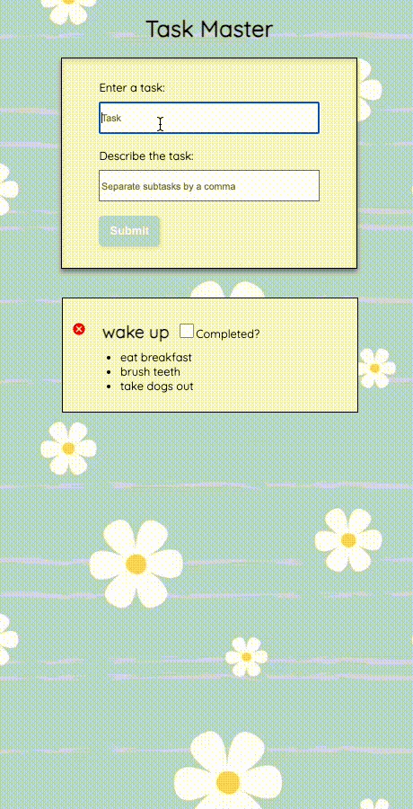

# Task Master

Task Master is an app that allows you to add and delete tasks.  It also allows you to add subtasks so that you can breakdown the larger tasks into smaller ones.  You can mark a task as completed and delete tasks after it completed.

#### Table of Contents
  - [Technologies](#Technologies)
  - [Installation](#Installation)
  - [Operation](#Operation)
  - [Preview](#Preview)
    - [Screenshots](#Screenshots)
  - [Testing](#Testing)

### Technologies

| Stack      | Dependancies   | Dev-dependancies |
| ---------- | -------------- | ---------------- |
| Node.js    | dotenv         | webpack/babel    |
| MongoDB    | mongoose       | eslint -airbnb   |
| Express.js | Express.js     | Jest             |
| React.js   | Axios          |

### Installation

1. Clone the repository

2. Use the package manager [npm](https://docs.npmjs.com/) to install the dependencies for Task Master.

   ```
   npm install
   ```

3. Start the client

   ```
   npm start
   ```

4. Start the server

   ```
   npm run start-dev
   ```

5. View in browser 

    `https://localhost:3000`

### Operation

-On load

`GET /tasks`

-Create new task

`POST /tasks`

-Update Completed task

`PUT /tasks/:id`

-Delete task

`DELETE /tasks/:id`

### Preview



### Testing

This application was tested using snapshots in **_Jest_**.

From within the root directory:

```
npm run test
```